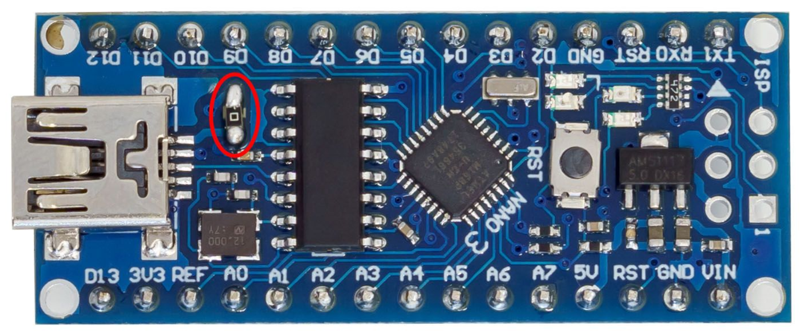

# Arduino Nano development kit
3Dsimo KIT is based on very popular Arduino Nano. It is very likely that you already come across it but in case you haven't yet here are some things you might find useful.

The first version of 3Dsimo KIT requires standard Arduino Nano board, but it is necessary to perform one small improvement (development boards supplied by 3Dsimo have this improvement performed). It is necessary to replace input protection diode which limits input power to the board. The 3D extension requires more than 1.5A and this diode limit the current to approx 500mA. It depends on type. Replacement is illustrated in the following image in red circle. There is replaced diode by 0R resistor.

