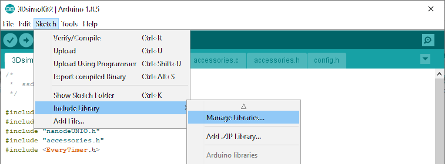
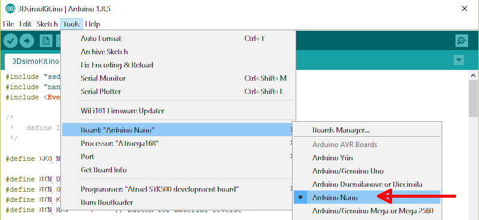
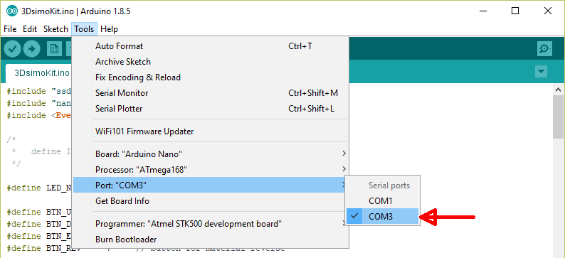
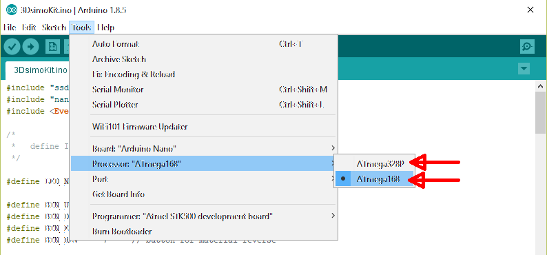
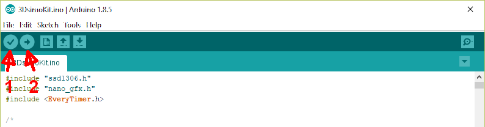
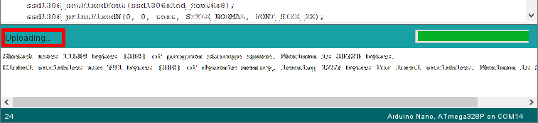
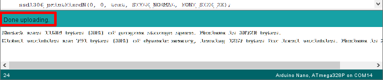

# Firmware for 3Dsimo KIT
If you want to learn how the pen works or you want to add your own material profiles, or you want to make some changes and tweaks, you are on the right address. The code is fully available and commented so you don't have trouble finding your way around. For both versions of the 3Dsimo KIT Firmwares are inside folders [FW](../FW). 

Microcontroller is programmed in C/C++ language in the editor [Arduino IDE](https://www.arduino.cc/). 

Main code is divided into several files, where every have different purpose. Following listing explains their purpose:
 - **config.h** is for setting pins and general settings of the board 
 - **accessories.c/.h** contains functions for every extension
 - **NanodeUNIO.c/.h** is library for one wire UNI/O protocol, it is used for identification the extensions

Before you start to program or edit the code, it is required to download some libraries listed below.

## Libraries to download
Code for 3Dsimo KIT requires following two libraries which have to be downloaded. 
 - **EveryTimer** by *Alessio Leoncini*
 - **ssd1306** by *Alexey Dynda*
 
Both libraries you can download directly from Arduino IDE according to following image (Sketch -> Include Library -> Manage Libraries ...)

## Setting up Arduino IDE
### Board
Both version of the 3Dsimo KIT requires to choose development kit Arduino Nano board (Tools -> Board: ... -> Arduino Nano)

### COM port
Select port where is connected your development kit (Tools -> Port -> COMxx). In the image, there is selected COM3, but your board can be connected to a different one.

### Processor
**3Dsimo KIT** can use both types of microcontroller, you have to check it which one you have. The most probably version is **ATmega168**. 

The **3Dsimo KIT 2** is using **ATmega328P** everytime. 

## Compiling and uploading code

When you finish editing your code, it is possible to verify it by the first button "Verify" (1) and in case of no errors upload it to the microcontroller by the second (2) button "Upload". Uploading progress bar will indicate the process of the upload. When code is successfully uploaded into microcontroller, the status will be following: "Done uploading".

In case of error, the editor will not permit to upload the code into microcontroller.

