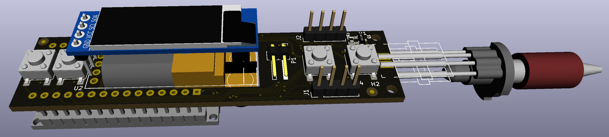

# Hardware for 3Dsimo KIT 2

3Dsimo KIT 2 is based on standard Arduino Nano platform with modified layout designed especially for 3D pen with interchangable extensions. Its simplified design lead to smaller footprint and thus smaller and more ergonomical design of the whole device. 

### Power
The pen runs at 5V power through micro USB connector which is possible to use as a programming interface as well. The device requires power adapter with at least 2A and 5V. 

### Display
OLED display based on SSD1306 driver is connected through an TWI interface to the microcontroller. There are two external pull-ups resistor which are making logical 1 for the TWI bus and no additional components are required.

### Programming interface
The microcontroller is possible to reprogram through the USB and USB<>UART converter. The layout is similar to standard Arduino Nano programming interface, but chosen converter is different - CP2102N. Program is written in C/C++ language in Arduino IDE. More information about programming you can find in [Firmware chapter](Firmware.md).

### Layout
3Dsimo KIT 2 contains 4 boards, where one is main board with MCU and three boards are used for interchangable extensions. All boards are designed in Open-source program [KiCAD](http://kicad.org/) in the recent version 5.1.4. 3D models are mainly taken from KiCADs repositories, but several were drawn or taken from the manufacturer and they are not included in KiCADs github. You can find them in folder with all [3D models](../pcb/Documents/3D) used for 3DSimo KIT.

### Temperature measurement
3Dsimo KIT2 is equipped with two ranges thermal measurement, one for PCL materials (temperatures in range from 30°C to 120°C) and the second one for other plastics material such as ABS, PLA, etc. (from 180°C to 300°C). These two ranges provides unlimited possibilities in different material usage. 

### Schematics and Assembling
Schematics of the 3Dsimo KIT 2 is possible to download at [following link](../pcb/Documents/3DsimoKit201_Schematics.pdf)

Assembling and components placement can be downloaded at [following link](../pcb/Documents/3DsimoKit201_AssemblyTop.pdf)

# Hardware for 3Dsimo Kit
3Dsimo KIT is developed on Arduino Nano like development board with additional interface board containing motor driver and OLED display. 

### Power
The pen runs at 5V power through mini USB connector located on Arduino Nano like board. The development board requires one modification, replace input protection diode for shortcut. 3Dsimo KIT requires power adapter with at least 2A and 5V. 

### Display
OLED display based on SSD1306 driver is connected through an TWI interface and additional board to the microcontroller. There are two external pull-ups resistor which are making logical 1 for the TWI bus and no additional components are required.

### Programming interface
The microcontroller is possible to reprogram through the mini USB connector placed directly on the Arduino Nano like development kit. Program is written in C/C++ language in Arduino IDE. More information about programming you can find in [Firmware chapter](Firmware.md).

### Layout
3Dsimo KIT contains one interface board, which is used for connecting display, buttons, motor driver and etc. with MCU. The board is designed in Open-source program [KiCAD](http://kicad.org/). 3D models are mainly taken from KiCADs repositories, but several were drawn or taken from the manufacturer and they are not included in KiCADs github. You can find them in folder with all [3D models](../pcb/Documents/3D) used for 3DSimo KIT.

### Temperature measurement
3Dsimo KIT is equipped with only one range for melting common plastics for 3D printers such as ABS, PLA, etc. and its range is from 180°C to 300°C. 

### Schematics and Assembling
Schematics of the 3Dsimo KIT 2 is possible to download at [following link](../pcb/Documents/3DsimoKit101_Schematics.pdf)

Assembling and components placement can be downloaded at the following links [TOP](../pcb/Documents/3DsimoKit101_AssemblyTop.pdf) and [BOTTOM](../pcb/Documents/3DsimoKit101_AssemblyBottom.pdf)

